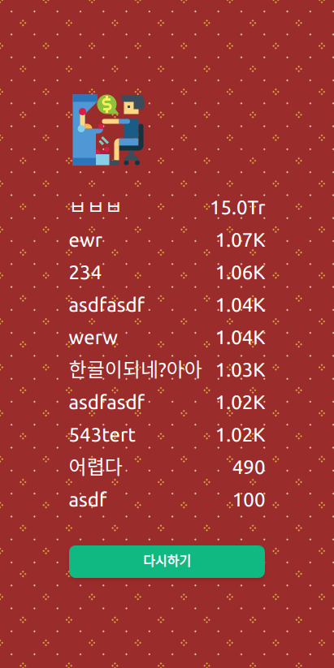

# Slot machine operator

Simple mini game to manage slot machines.

## Quick start

```bash
yarn
yarn dev
```

## Stack

- [Node.js](https://nodejs.org/ko/)
- [TypeScript](https://www.typescriptlang.org/)
- [React](https://reactjs.org/)
- [Vite](https://vitejs.dev/)
- [tailwindcss](https://tailwindcss.com/)
- [Animista](https://animista.net/)
- [flaticon](https://www.flaticon.com/)

## Screenshots

| #1                             | #2                             | #3                             |
| ------------------------------ | ------------------------------ | ------------------------------ |
|  |  |  |
|  |  |  |

## Thanks to

- [Resources](./RESOURCES.md)

## License

MIT
